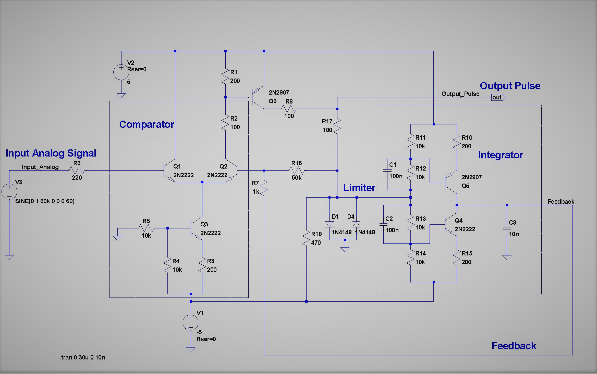
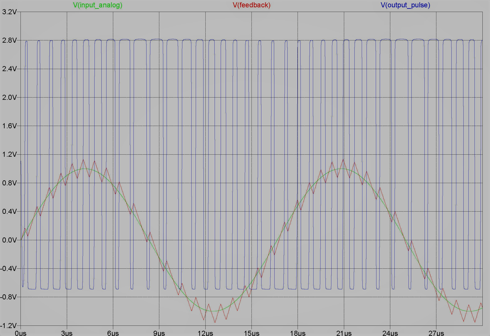

# 

 
In this sample project a transistor-based analog-to-digital converter is interfaced to FPGA to implement a low-cost ADC. To design the ADC, an especial technique is developed based of the idea behind SAR (successive accumulation register) technique and pulse width modulation. The designed ADC consists of two blocks: comparator and integrator which are implemented by BJT transistors. The output pulse-width of ADC is proportional to the differential of input analog signal. At the FPGA side, an integrator is applied to the input pulse to reconstruct the original input signal. However a problem arises if there is a mismatch between zero and one periods of the pulse (because of mismatch in low-side and high-side of integrator circuit). So there's a need to compensate this mismatch inside the FPGA. Moreover, a high-pass FIR filter (with 16-tap) with a cut-off frequency around few KHz is used to eliminate any DC value as well as errors caused by imperfection in compensator mechanism. The output results are send through WIFI to the PC with a Java app running to monitor the outcome of ADC process. 
#### ADC schematic:

 
#### Spice simulation:

 
#### Monitoring with Java Application:

 

[VHDL_code_preview](SPARTAN_PROJ_ISE/Top_Design.vhd)  
 
Information about WIFI and Java application are provided in repository:
[ADC_FPGA_WIFI](https://github.com/Hamid-R-Tanhaei/ADC_FPGA_WIFI)  

 
 

## Author:
### Hamid Reza Tanhaei

